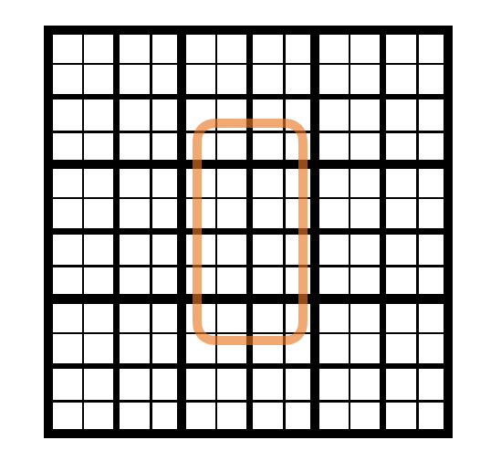

# Map Marker Guide

지도에 마커를 표시하기 위한 방법에 대해 작성한 문서 

## Web Mercator(EPSG:3857)

네이버, 구글, 카카오 등 주요 웹 지도 서비스가 채택한 표준 투영법입니다.

특징: 지구를 구체로 가정하고 정사각형 평면에 투영합니다.

장점: 줌 레벨에 따른 타일 분할이 수학적으로 명확하며, 계산 속도가 빨라 웹/모바일 환경에 최적화되어 있습니다.

## 공간 인덱싱

이버 지도의 설계 구조상 데이터 인덱싱에 Base4(Quadtree) 방식을 사용하는 것이 가장 효율적입니다.

줌 레벨 일치: 네이버 지도가 제공하는 최대 줌 레벨(22)은 Base4 공간 인덱싱에서 일반적으로 사용하는 최대 정밀도(Precision 22)와 일치합니다.

보편성: 일반적으로 Base4를 사용합니다. 

## 화면의 표시

단순히 화면 중심점의 데이터만 가져오는 것이 아니라, 화면 전체를 커버할 수 있는 영역을 계산하여 데이터를 호출합니다.

정밀도 설정: 현재 줌 레벨(Z)을 기준으로 Z+2 단계의 정밀도를 가진 지오해싱(Geohashing) 영역을 기본 단위로 설정합니다.

영역 확장: 디바이스의 가로/세로 비율을 고려하여 중심 좌표가 속한 영역을 기준으로 **3x5(총 15개)**의 그리드 영역을 추출합니다.

가로(3): 좌, 중, 우 영역 커버

세로(5): 상하로 긴 모바일 디스플레이 특성을 고려한 범위 확장

데이터 샘플링: 각 15개 영역당 최대 3개씩의 게시글 정보를 가져와 화면에 표시함으로써 마커 과밀 현상을 방지하고 가독성을 확보합니다.

특정 줌 레벨에 표시되는 화면 영역에 대한 이미지입니다. 현재 줌 레벨을 17로 가정하면 가장 굵은 선은 Base4 기준에서 Precision 17 영역, 중간선은 Precision 18의 영역, 얇은 선은 19의 영역입니다. 

