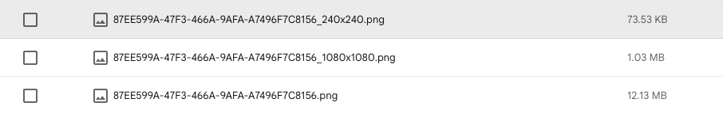

# Performance

Rim 개발 중 성능 개선 사례를 작성한 문서 

## 목차 

## 이미지 로딩 성능 최적화

**문제 상황 (Why)**

지도 마커를 가져오기 위해 원본 이미지(대략 12MB)를 가져옴. 
데이터 낭비가 심함

**해결 방법 (How)**
서버 (Firebase Extension):

Resize Images 익스텐션 설치.

업로드 시 240x240(마커용), 1080x1080(상세용) 자동 생성

클라이언트 (iOS):

ResizeImageFinder 구현: 원본 URL(~.jpg)을 넣으면 썸네일 URL(~_240x240.jpg)을 찾아오도록 구현 (토큰 문제 해결).

**결과 (Result)** 

|항목|개선 전|개선 후|비고|
|---|---|---|---|
|데이터 크기|	12 MB|	75 KB|	99.4% 감소|

